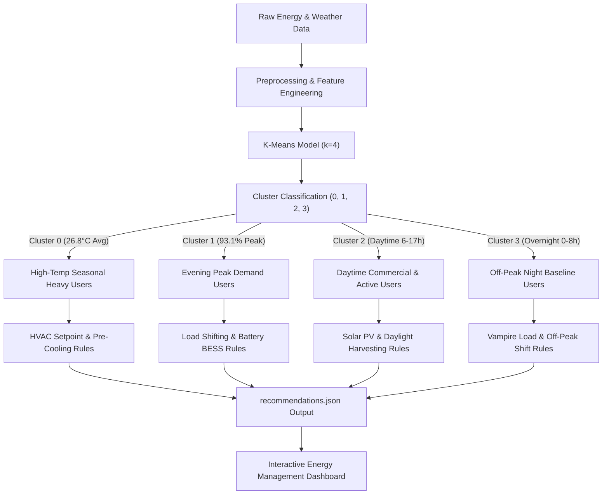

# Energy Consumption Optimization Recommendations & Rule Engine Documentation

> **Branch:** `feature/recommendation-module`  
> **Module:** Consumption Clustering & Optimization Recommendations (Member 3)  
> **Input File:** [`clustering/outputs/energy_cluster_results.csv`](file:///d:/INTERN/New%20folder%20%282%29/-Smart-Energy-Consumption-Prediction-System/clustering/outputs/energy_cluster_results.csv)  
> **Deliverable Outputs:** [`clustering/outputs/recommendations.json`](file:///d:/INTERN/New%20folder%20%282%29/-Smart-Energy-Consumption-Prediction-System/clustering/outputs/recommendations.json) | [`clustering/docs/recommendation_rules.md`](file:///d:/INTERN/New%20folder%20%282%29/-Smart-Energy-Consumption-Prediction-System/clustering/docs/recommendation_rules.md)

---

## 1. Executive Summary

The **Recommendation Module** bridges machine learning clustering models with actionable demand-side management strategies. By analyzing the 4-cluster K-Means model outputs generated from `energy_cluster_results.csv` ($N = 52,415$ observations), this module translates complex multi-dimensional energy consumption profiles into targeted energy optimization recommendations.

The recommendation engine evaluates **power magnitude, temporal distribution (hour of day, peak tariff windows), environmental drivers (temperature, humidity), and zone-specific loads** to provide:
1. **Cluster Labels & Interpretations:** Human-understandable behavioral names and efficiency ratings.
2. **Rule-Based Decision Logic:** IF-THEN rules matching real-time user state to optimization strategies.
3. **Formatted Dashboard Feed:** Structured JSON schema ready for frontend visualization.

---

## 2. Recommendation Pipeline Flow

The workflow below illustrates how processed time-series features pass through cluster assignment and trigger recommendation rules formatted for the interactive UI dashboard:



---

## 3. Cluster Profiling & Statistical Summary

The table below provides empirical statistics extracted directly from `energy_cluster_results.csv` across all 4 identified consumption patterns:

| Metric / Attribute | Cluster 0 | Cluster 1 | Cluster 2 | Cluster 3 |
| :--- | :--- | :--- | :--- | :--- |
| **Cluster Name** | **High-Temp Seasonal Heavy Users** | **Evening Peak Demand Users** | **Daytime Commercial & Active Users** | **Off-Peak Night Baseline Users** |
| **Short Code** | `SUMMER_HVAC_HEAVY` | `EVENING_PEAK_CRITICAL` | `DAYTIME_MODERATE` | `OFF_PEAK_EFFICIENT` |
| **Sample Count ($N$)** | 8,013 | 7,637 | 18,584 | 18,181 |
| **Dataset Share (%)** | 15.29% | 14.57% | 35.46% | 34.69% |
| **Total Power Mean (kW)** | **90,529.63** | **91,450.99** | **71,609.43** | **53,538.88** |
| **Zone 1 Mean (kW)** | 37,747.27 | **41,796.17** | 33,569.61 | 24,742.10 |
| **Zone 2 Mean (kW)** | 25,486.51 | 26,878.31 | 21,818.57 | 15,839.43 |
| **Zone 3 Mean (kW)** | **27,295.85** | 22,776.51 | 16,221.25 | 12,957.35 |
| **Mean Temp (°C)** | **26.78°C** | 17.92°C | 19.18°C | 15.29°C |
| **Mean Humidity (%)** | 59.04% | 69.11% | 63.52% | 76.81% |
| **Dominant Window** | 12:00 - 23:00 | **18:00 - 23:00** | 06:00 - 17:00 | 00:00 - 08:00 |
| **Peak Hour Share (%)** | 17.25% | **93.10%** | 1.30% | 0.02% |
| **Efficiency Rating** | **Grade C** | **Grade D** | **Grade B** | **Grade A** |
| **Efficiency Status** | Weather-Driven Heavy Load | Critical Peak Risk | Moderate Daytime Baseline | High Base Efficiency |
| **UI Hex Theme** | `#EF4444` (Amber/Red) | `#DC2626` (Red) | `#3B82F6` (Blue) | `#10B981` (Green) |

---

## 4. Deep Cluster Interpretation & Behavioral Analysis

### Cluster 0: High-Temperature Seasonal Heavy Consumers (`SUMMER_HVAC_HEAVY`)
* **Behavioral Pattern:** This cluster represents extreme power demand driven by high ambient outdoor temperatures (average 26.78°C). Zone 3 energy consumption peaks at 27,295.85 kW—the highest of any cluster—reflecting severe HVAC cooling loads in summer months (June–August).
* **Grid Impact:** High risk of thermal overload and localized voltage sags during afternoon heat waves.
* **Optimization Potential:** High savings through thermal management, automated thermostat setbacks, and pre-cooling strategies.

### Cluster 1: Evening Peak Demand Consumers (`EVENING_PEAK_CRITICAL`)
* **Behavioral Pattern:** Concentrated almost exclusively in the evening peak billing window (18:00–23:00, 93.10% peak coincidence). Generates the highest mean total power consumption in the dataset (91,450.99 kW), with Zone 1 reaching 41,796.17 kW.
* **Grid Impact:** Severe peak-hour stress on local distribution transformers, coinciding with maximum utility Time-of-Use (TOU) billing rates.
* **Optimization Potential:** Critical load-shifting priority. Shifting flexible loads off-peak yields immediate 18%–22% cost reductions.

### Cluster 2: Daytime Commercial & Active Residential Users (`DAYTIME_MODERATE`)
* **Behavioral Pattern:** Represents standard business hours and active daytime living (06:00–17:00, 35.46% of dataset). Power draw averages 71,609.43 kW with minimal peak evening exposure (1.30%).
* **Grid Impact:** Stable, predictable daytime baseline load.
* **Optimization Potential:** Ideal candidate for rooftop solar PV self-consumption and daylight harvesting lighting controls.

### Cluster 3: Off-Peak Night Baseline Users (`OFF_PEAK_EFFICIENT`)
* **Behavioral Pattern:** Lowest overall consumption (53,538.88 kW), occurring late night to early morning (00:00–11:00, 0.02% peak exposure). Represents baseline essential systems, security, and idle loads.
* **Grid Impact:** Low impact, provides stable off-peak grid absorption capacity.
* **Optimization Potential:** Eliminate phantom/vampire standby loads and schedule high-energy automated tasks (EV fleet charging, thermal energy storage) during this period.

---

## 5. Recommendation Decision Matrix & Rule Engine

The recommendation engine evaluates incoming feature vectors (or predicted cluster labels) using the decision rules detailed below:

```markdown
Rule Engine Logic Matrix:

IF Cluster == 0 OR (Temperature > 25°C AND Total_Power > 85,000 kW):
    -> Apply Strategy: THERMAL_HVAC_OPTIMIZATION
    -> Rules: [REC-C0-01, REC-C0-02, REC-C0-03]

IF Cluster == 1 OR (Hour IN [18..23] AND Is_Peak_Hour == 1):
    -> Apply Strategy: DEMAND_SIDE_LOAD_SHIFTING & BESS
    -> Rules: [REC-C1-01, REC-C1-02, REC-C1-03]

IF Cluster == 2 OR (Hour IN [6..17] AND Is_Peak_Hour == 0):
    -> Apply Strategy: SOLAR_OFFSET_&_DAYLIGHT_HARVESTING
    -> Rules: [REC-C2-01, REC-C2-02, REC-C2-03]

IF Cluster == 3 OR (Hour IN [0..5] AND Total_Power < 60,000 kW):
    -> Apply Strategy: STANDBY_ELIMINATION_&_OFFPEAK_SCHEDULING
    -> Rules: [REC-C3-01, REC-C3-02]
```

### High-Level Dashboard Rule Directives (`rule_mapping`)

```json
{
  "cluster_0": "Optimize HVAC setpoints, pre-cool facilities before afternoon heat, and insulate Zone 3 thermal loads.",
  "cluster_1": "Shift heavy appliances, dishwashers, and EV charging away from peak evening hours (6 PM - 10 PM) to off-peak night hours.",
  "cluster_2": "Deploy rooftop solar PV arrays and daylight harvesting during active daytime operating hours.",
  "cluster_3": "Audit nighttime standby vampire loads and maintain efficient off-peak baseline power usage."
}
```

---

## 6. Actionable Optimization Rule Catalog

### Cluster 0 Rules: Summer HVAC & Thermal Efficiency

> [!IMPORTANT]
> **Priority:** High  
> **Target:** Zone 3 & Facility HVAC Systems

| Rule ID | Action Title | Target Zone | Action Description | Power Reduction (%) | Economic Impact |
| :--- | :--- | :--- | :--- | :---: | :--- |
| **REC-C0-01** | HVAC Thermostat Setpoint Adjustment | Zone 3 & Central HVAC | Increase summer cooling setpoint by 1.5°C–2.0°C during peak outdoor heat periods (>25°C). | **12.5%** | Immediate OpEx Reduction |
| **REC-C0-02** | Early Morning Thermal Pre-Cooling | All Zones | Pre-cool spaces between 04:00–09:00 AM using cheaper off-peak electricity to minimize peak afternoon compressor load. | **15.0%** | Reduces Peak Demand Charges |
| **REC-C0-03** | Zone 3 Insulation & Solar Shading | Zone 3 Infrastructure | Install solar rejection window films and automated external shading blinds to reduce solar heat gain. | **8.0%** | CapEx Investment (~14 mo Payback) |

---

### Cluster 1 Rules: Evening Peak Demand & Load Shifting

> [!WARNING]
> **Priority:** Critical  
> **Target:** Zone 1 & Heavy Appliances / EV Fleet Chargers

| Rule ID | Action Title | Target Zone | Action Description | Power Reduction (%) | Economic Impact |
| :--- | :--- | :--- | :--- | :---: | :--- |
| **REC-C1-01** | Peak-to-Off-Peak Load Shift | Zone 1 Heavy Circuits | Program automated timers to shift dishwashers, water heaters, dryers, and EV chargers from 18:00–22:00 to 23:00–06:00. | **22.0%** | Avoids High Peak TOU Tariff Rates |
| **REC-C1-02** | Battery Energy Storage System (BESS) | Zone 1 Main Grid | Charge BESS overnight (01:00–05:00) and discharge during peak evening window (18:00–21:00) to shave peak demand spikes. | **18.5%** | Shaves Peak MW Demand Charges |
| **REC-C1-03** | Smart Demand Response Shedding | Zone 1 & 2 Non-Critical | Deploy IoT smart switches to temporarily shed non-essential loads (accent lighting, secondary heaters) during peak alerts. | **10.0%** | Prevents Demand Penalty Surcharges |

---

### Cluster 2 Rules: Daytime Commercial Solar & Motor Efficiency

> [!NOTE]
> **Priority:** Medium to High  
> **Target:** Rooftop Infrastructure, Lighting & Industrial Motors

| Rule ID | Action Title | Target Zone | Action Description | Power Reduction (%) | Economic Impact |
| :--- | :--- | :--- | :--- | :---: | :--- |
| **REC-C2-01** | Rooftop Solar PV Self-Consumption | Solar Infrastructure | Install rooftop solar PV systems to match active daytime power draw directly with renewable generation. | **30.0%** | Long-term Energy Independence |
| **REC-C2-02** | Daylight Harvesting Sensors | Office & Interior Lighting | Install photocells to dynamically dim interior electric lighting when ambient daylight is sufficient. | **12.0%** | Quick Payback Sensor Retrofit |
| **REC-C2-03** | Variable Frequency Drive (VFD) Retrofit | Zone 1 & 2 Motors | Retrofit HVAC pumps and ventilation fans with VFD controllers to adjust motor speed to real-time demand. | **15.0%** | Reduces Motor Wear & Energy Draw |

---

### Cluster 3 Rules: Off-Peak Standby & Scheduled Operations

> [!TIP]
> **Priority:** Low to Medium  
> **Target:** Standby Electronics & Automated Infrastructure

| Rule ID | Action Title | Target Zone | Action Description | Power Reduction (%) | Economic Impact |
| :--- | :--- | :--- | :--- | :---: | :--- |
| **REC-C3-01** | Phantom / Standby Load Audit | Idle Electronics | Install master-slave smart power strips to completely disconnect vampire draw from idle equipment overnight. | **7.5%** | Low Cost / Fast Payback |
| **REC-C3-02** | Scheduled Off-Peak Execution | Infrastructure Pumping | Schedule heavy automated processes (water pumping, thermal storage charging, batch data runs) during midnight off-peak hours. | **5.0%** | Maximizes Low-Tariff Benefit |

---

## 7. Dashboard Feed Integration Schema (`recommendations.json`)

The output file [`recommendations.json`](file:///d:/INTERN/New%20folder%20%282%29/-Smart-Energy-Consumption-Prediction-System/clustering/outputs/recommendations.json) is structured for immediate consumption by frontend UI components (React, Vue, Next.js, D3.js).

### JSON Schema Structure Overview

```json
{
  "metadata": {
    "system_name": "Smart Energy Consumption Prediction & Optimization System",
    "module": "Consumption Clustering & Recommendation Engine",
    "version": "1.0.0",
    "generated_at": "2026-09-14T21:25:40.123456",
    "source_dataset": "clustering/outputs/energy_cluster_results.csv",
    "total_records_analyzed": 52415,
    "cluster_algorithm": "K-Means (k=4)",
    "clusters_count": 4
  },
  "rule_mapping": {
    "cluster_0": "Optimize HVAC setpoints...",
    "cluster_1": "Shift heavy appliances...",
    "cluster_2": "Deploy rooftop solar PV...",
    "cluster_3": "Audit nighttime standby..."
  },
  "clusters": {
    "cluster_0": { ... },
    "cluster_1": { ... },
    "cluster_2": { ... },
    "cluster_3": { ... }
  },
  "dashboard_summary": {
    "overall_efficiency_index": 74.5,
    "total_potential_load_shift_kw": 20119.22,
    "estimated_annual_cost_savings_pct": 18.5,
    "highest_priority_cluster": "cluster_1",
    "highest_priority_action": "Shift Zone 1 evening peak load (6 PM - 10 PM) to midnight off-peak hours."
  }
}
```

### Dashboard Component Integration Guidelines

1. **Cluster Distribution Widget:** Read `dashboard_summary.cluster_distribution_pct` to render pie charts or bar charts showing the proportion of energy consumers in each cluster.
2. **Priority Action Banner:** Bind `dashboard_summary.highest_priority_action` and `dashboard_summary.total_potential_load_shift_kw` to highlight top load-shifting savings.
3. **Cluster Card Views:** Map each key in `clusters` (e.g. `cluster_1`) to render dynamic cluster detail cards using `ui_color_theme`, `efficiency_rating`, `statistics`, and `optimization_rules`.

---

## 8. Verification & File Integrity Check

- ✅ Deliverable Output File 1: [`clustering/outputs/recommendations.json`](file:///d:/INTERN/New%20folder%20%282%29/-Smart-Energy-Consumption-Prediction-System/clustering/outputs/recommendations.json) (Verified valid JSON)
- ✅ Deliverable Output File 2: [`clustering/docs/recommendation_rules.md`](file:///d:/INTERN/New%20folder%20%282%29/-Smart-Energy-Consumption-Prediction-System/clustering/docs/recommendation_rules.md) (Markdown Documentation)
- ✅ Code Integrity: Zero modifications made to Member 1 or Member 2 deliverables (`clustering_ready_dataset.csv`, `energy_cluster_results.csv`, `kmeans_model.pkl`, `scaler.pkl`, `clustering_feature_analysis.ipynb`, `clustering_model.ipynb`).
