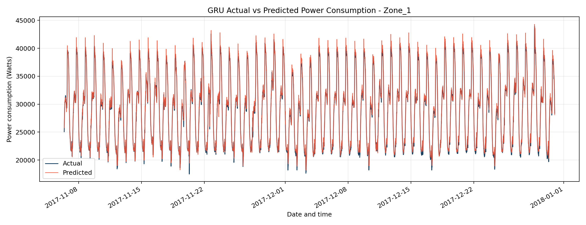
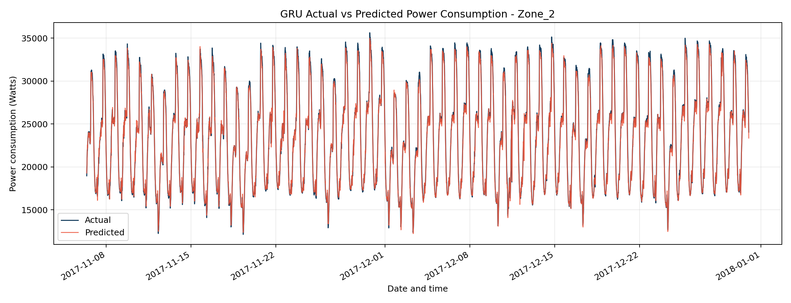
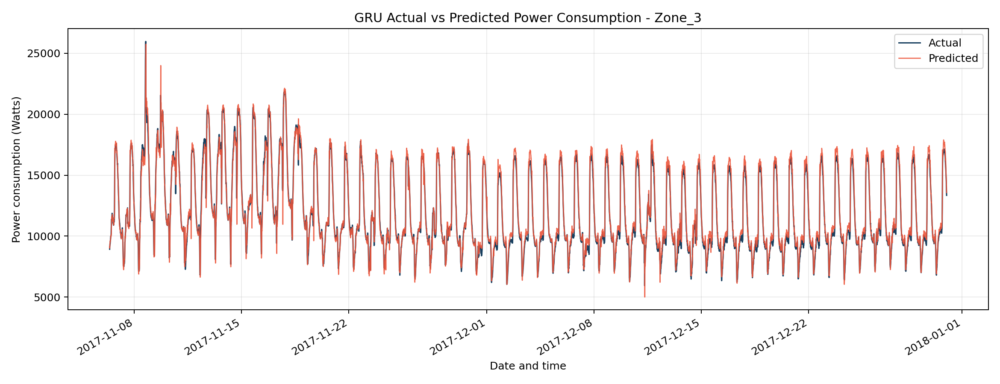
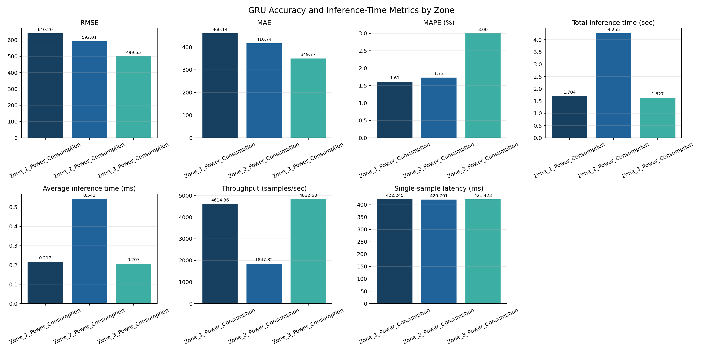
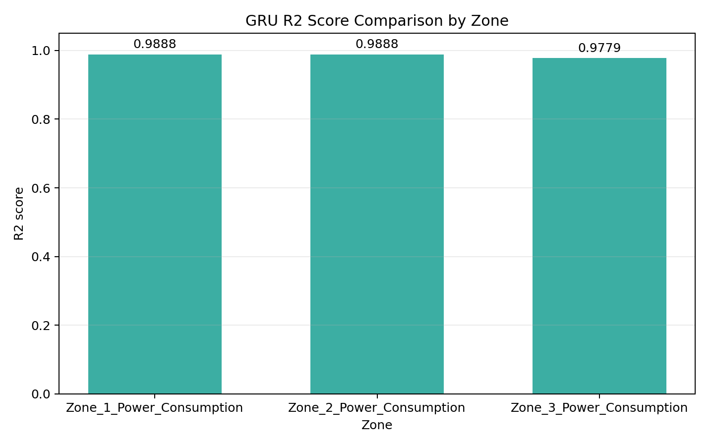

# GRU Branch - Methodology & Validation Report

## Objective

Forecast each zone's power consumption 10 minutes ahead from a 24-hour
lookback window, maximising accuracy while keeping inference response time
low enough for a live dashboard.

## Data

Uses the shared harness built by Member 1 (`data_harness.
prepare_zone_data`), unchanged: `train.csv` / `validation.csv` / `test.csv`,
144-step lookback, 1-step horizon, per-zone common + lag/rolling features
(27 features per zone). See `../README.md` for the harness contract.

## Architecture Search

Four hand-picked candidates (`gru_config.GRU_ARCHITECTURES`), spanning a
deliberate accuracy/speed range rather than a blind grid search:

| Name              | Layers             | Dropout | Dense head |
| ----------------- | ------------------ | ------- | ---------- |
| gru_small         | GRU(64)            | 0.0     | -          |
| gru_medium        | GRU(128)           | 0.2     | Dense(32)  |
| gru_stacked_small | GRU(64) → GRU(32)  | 0.1     | -          |
| gru_stacked_large | GRU(128) → GRU(64) | 0.2     | Dense(32)  |

Each candidate trains with Adam, early stopping on validation loss
(patience 6, `restore_best_weights=True`), batch size 256, up to 60 epochs.

## Selection Rule

1. Measure validation RMSE (original Watts) and single-sample inference
   latency for every candidate.
2. Discard candidates whose latency exceeds `LATENCY_TOLERANCE` (3x, by
   default) the fastest candidate's latency.
3. Among the remainder, pick the lowest validation RMSE.

This is implemented in `train_gru.select_best_architecture` so the
accuracy/speed trade-off is explicit and auditable rather than left as an
implicit judgment call.

## Refit & Final Evaluation

The selected architecture is retrained on train + validation combined,
for the epoch count found during search (no further early stopping - the
epoch count is itself the carried-over tuned hyperparameter). It is then
evaluated exactly once on the untouched test split.

Reported per zone (`docs/results/results_gru.csv`):

- **Accuracy**: RMSE, MAE, MAPE, R2 - all inverse-transformed to original
  Watts using the saved scaler.
- **Response time**: total inference time over the full test set, average
  per-sample time, throughput (samples/sec), and single-sample latency
  (measured separately via a direct model call, since batched
  `model.predict()` throughput isn't representative of a single real-time
  request).

## Validation Run (Not Final Results)

Before handing this off, the pipeline was run end-to-end in smoke-test
mode (`main(smoke_test=True)`: 1 zone, 2 architectures, 3 epochs each) to
confirm there are no runtime errors and that every stage produces
correctly shaped output. Observed in that run:

- Both candidates trained, were evaluated, and correctly compared on
  validation RMSE + latency.
- The lighter architecture (`gru_small`) was selected, refit on
  train+validation, and evaluated on the full Zone_1 test set (7,863 rows)
  without errors.
- Test-set R2 was already ~0.96 after just 3 epochs - expected, since the
  1-step-ahead lag feature makes this an easy task to get roughly right
  quickly, and it confirms the windowing/scaling/inverse-transform path is
  correct. **RMSE at this stage (~1,260 W) is not a real result** - it
  reflects 3 epochs on 1 zone, not a tuned model, and should not be
  compared against the Forecasting/Regression team's numbers.
- Single-sample latency measurements were in the ~270 ms range in this
  sandbox - this is dominated by single-core CPU call overhead in the
  validation environment, not representative of real hardware. Re-measure
  on the actual training machine (ideally the same machine used for the
  LSTM branch, for a fair comparison) before finalising the response-time
  figures.
- A harmless `InconsistentVersionWarning` appeared when loading
  `minmax_scaler.pkl` (scikit-learn version mismatch between the machine
  that saved it and the one loading it). Functionally fine for
  `MinMaxScaler`, but worth aligning scikit-learn versions across the team
  to avoid the warning.

## Final Test Results

The final models were refit on the combined training and validation data,
then evaluated on the untouched test split. Each zone contains 7,863 test
samples. The complete results are available in
[`docs/results/results_gru.csv`](docs/results/results_gru.csv).

| Zone   | Selected architecture | RMSE (W) | MAE (W) | MAPE (%) |     R2 | Total inference (s) | Avg. inference (ms) | Throughput (samples/s) | Single-sample latency (ms) |
| ------ | --------------------- | -------: | ------: | -------: | -----: | ------------------: | ------------------: | ---------------------: | -------------------------: |
| Zone 1 | `gru_small`           |   640.20 |  460.14 |     1.61 | 0.9888 |               1.704 |               0.217 |               4,614.36 |                    422.245 |
| Zone 2 | `gru_medium`          |   592.01 |  416.74 |     1.73 | 0.9888 |               4.255 |               0.541 |               1,847.82 |                    420.701 |
| Zone 3 | `gru_small`           |   499.55 |  349.77 |     3.00 | 0.9779 |               1.627 |               0.207 |               4,832.50 |                    421.423 |

### Results Summary

- Zone 3 achieved the lowest RMSE and MAE, with errors of 499.55 W and
  349.77 W respectively.
- Zone 1 and Zone 2 achieved the highest R2 score at 0.9888.
- Zone 2 had the slowest inference performance, with 0.541 ms average
  per-sample inference time and 1,847.82 samples/sec throughput.
- Zone 3 had the highest throughput at 4,832.50 samples/sec.
- MAPE ranges from 1.61% to 3.00% across the three zones.

## Visualizations

The plots below are generated by running:

```powershell
python -m lstm_gru.gru.gru_visualizations
```

### Actual vs. Predicted Power Consumption

#### Zone 1



#### Zone 2



#### Zone 3



### Accuracy and Inference-Time Comparison

The comparison figure shows the original metric values, with each metric
displayed in its own subplot and labeled above the bars.



### R2 Comparison


