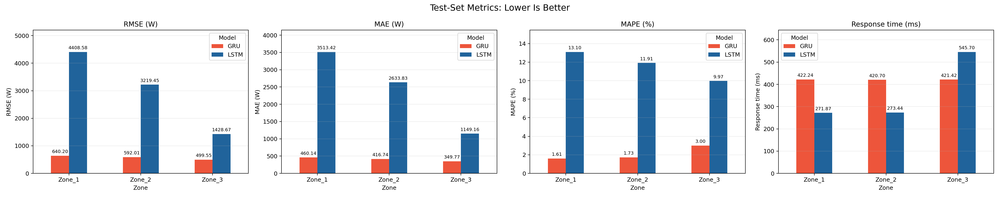
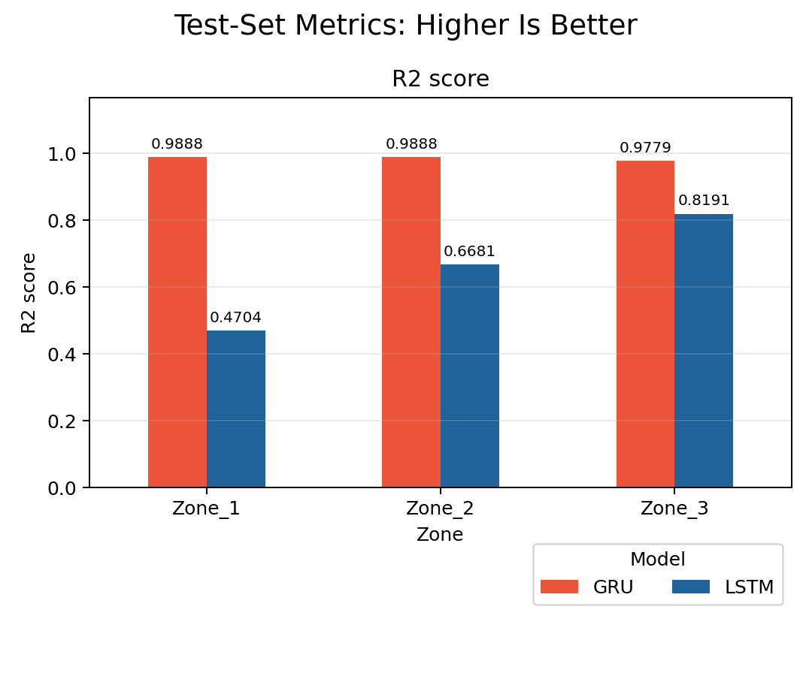
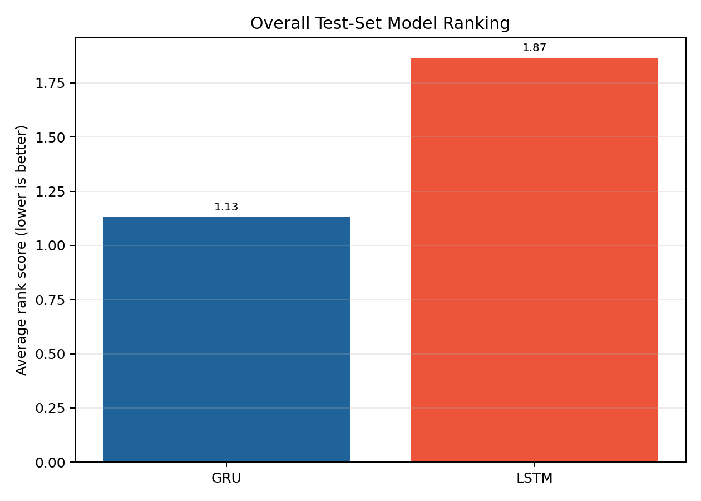

# LSTM vs GRU Test-Set Comparison

## Scope

This comparison uses final **test-set results only**. Validation metrics,
training history, and tuning results are excluded from model selection.
The source files are [`lstm_final_summary.csv`](../lstm/results/lstm_final_summary.csv)
and [`results_gru.csv`](../gru/docs/results/results_gru.csv).

## Comparison Rules

- Lower is better: RMSE, MAE, MAPE, and response time.
- Higher is better: R2.
- Response time is LSTM `Average_Response_Time_ms` and GRU
  `Single_Sample_Latency_ms`, because both measure one sample at a time.
- GRU `Avg_Inference_Time_Per_Sample_ms` is a separate batched-throughput
  metric and is not used as single-sample response time.
- Models are ranked within each zone for every common test metric.
- The average rank gives equal weight to accuracy and response time.
- The lowest average rank is selected per zone and overall.
- GRU-only throughput and batched inference fields are preserved in the source
  results but are not used in the cross-model ranking because the LSTM summary
  does not report equivalent test-set fields.

## Test-Set Metrics

| Zone | Model | RMSE (W) | MAE (W) | MAPE (%) | R2 | Response time (ms) | Average rank |
| --- | --- | ---: | ---: | ---: | ---: | ---: | ---: |
| Zone_1 | GRU | 640.20 | 460.14 | 1.61 | 0.9888 | 422.24 | 1.20 |
| Zone_1 | LSTM | 4408.58 | 3513.42 | 13.10 | 0.4704 | 271.87 | 1.80 |
| Zone_2 | GRU | 592.01 | 416.74 | 1.73 | 0.9888 | 420.70 | 1.20 |
| Zone_2 | LSTM | 3219.45 | 2633.83 | 11.91 | 0.6681 | 273.44 | 1.80 |
| Zone_3 | GRU | 499.55 | 349.77 | 3.00 | 0.9779 | 421.42 | 1.00 |
| Zone_3 | LSTM | 1428.67 | 1149.16 | 9.97 | 0.8191 | 545.70 | 2.00 |

## Final Selections

### Best Model Per Zone

| Zone | Selected model | Average rank | Reason |
| --- | --- | ---: | --- |
| Zone_1 | **GRU** | 1.20 | Wins on RMSE, MAE, MAPE, R2; best equal-weighted test-set rank. |
| Zone_2 | **GRU** | 1.20 | Wins on RMSE, MAE, MAPE, R2; best equal-weighted test-set rank. |
| Zone_3 | **GRU** | 1.00 | Wins on RMSE, MAE, MAPE, R2, Response_Time_ms; best equal-weighted test-set rank. |

### Overall Best Model

**GRU** is the overall best model with an average rank of **1.13** across all zones.
This selection reflects the best combined test-set balance of prediction
accuracy and response time under the stated metric directions.

## Generated Assets

- [`comparison_test_metrics.csv`](comparison_test_metrics.csv)
- [`comparison_rankings.csv`](comparison_rankings.csv)
- [`best_model_per_zone.csv`](best_model_per_zone.csv)
- [`overall_model_scores.csv`](overall_model_scores.csv)
- [`overall_best_model.csv`](overall_best_model.csv)

### Visualizations







## Reproduce

```powershell
python -m lstm_gru.overall_visualization
```
